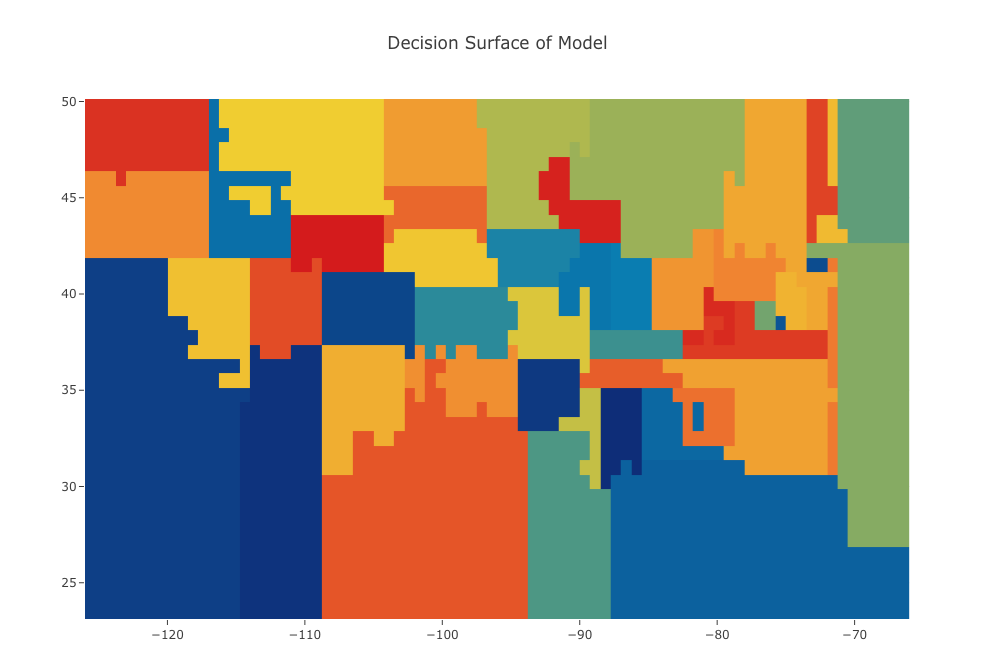
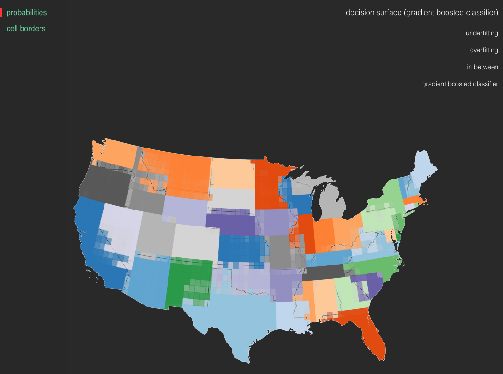

# A Visual Look at Under and Overfitting using U.S. States

A visual example of the concepts of under and overfitting in supervised
machine learning using U.S. state border data provided by the U.S.
Census Bureau.

[](https://opensource.org/licenses/MIT)

## What's Inside?

This repository contains a jupyter notebook and D3 visualization that showcases visual
examples of the concepts of under and overfitting. In the notebook,
data is processed, models are fit, and decision surfaces visualized, as
shown below.



The D3 visualization can be used to explore decision surfaces generated in the
notebook interactively.



## How To

From this repository's root directory, do the following to start the notebook:

```sh
cd notebooks
jupyter notebook
```

Click `Under and Overfitting by Example - 48 U.S. Contiguous States.ipynb`.

To start the D3 visualization, the following will work using Python 3:

```sh
cd visualization
```
```python
python3 -m http.server
```

The initial load may take a few seconds while the data is processed. Use
the toggle switches in the top left to alter views and the selections in
the top right to select between models.

## License
This project is licensed under the MIT license.

## Contributors

- [Valentino Constantinou](https://github.com/vc1492a)
- Christopher Laporte

## Acknowledgements

- [Ian Colwell](https://github.com/iancolwell)
- [Kyle Hundman](https://github.com/khundman)
